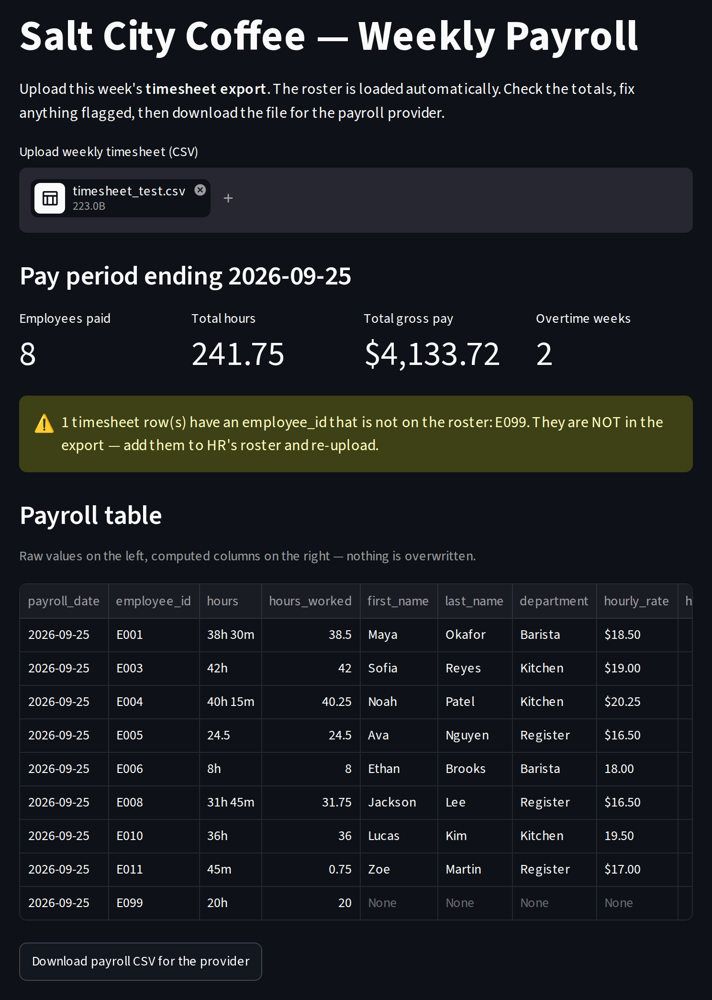

# IST356 Assignment 04 — Timesheets to Payroll

Every other Friday, the office manager at **Salt City Coffee** does payroll by hand.
The point-of-sale system exports a **timesheet** — one row per person who worked that
week, with hours typed in by whichever shift lead closed: `"38h 30m"`, `"42h"`,
`"24.5"`, `"45m"`. HR keeps the **employee roster** in a different file — one row per
person, with an hourly rate typed as `"$18.50"` or `"17.75"`. Neither file can produce
a paycheck on its own. She copies both into a spreadsheet, cleans the hours by hand,
looks up each rate, multiplies, and uploads the result to the online payroll provider.
It takes an afternoon, and last month nobody could explain a paycheck because the raw
hours had been overwritten by the cleaned ones.

You're going to replace the afternoon with a web page. Upload the timesheet, read the
totals, download the provider's file. Behind the page is an **ETL pipeline** in pandas —
the same Extract / Transform / Load you built with plain Python in Assignment 02, now
with DataFrames — and it follows one rule that makes the whole thing trustworthy:

> **A pipeline step adds columns. It never overwrites a value, never removes a column,
> never renames one, and never changes the frame it was given.**

That rule has a name, **data lineage**, and this assignment is where it stops being a
slogan. When `"38h 30m"` sits in the table next to `38.5`, the manager can check the
parse by eye. When an auditor asks where `$817.59` came from, every number that fed it
is still in the row. The tests enforce the rule on every step, so you will feel it
before you are told it.

## Meta

### Learning Objectives

By the end of this assignment you will be able to:

1. **Explain data lineage** and why a pipeline adds columns rather than replacing them
2. **Write element functions** that turn one messy value into one clean number, and coerce unreadable values to zero rather than crashing
3. **Use `Series.apply`** to run an element function down a column into a new column
4. **Use `DataFrame.apply(axis=1)`** with a lambda to compute a new column from several columns in the same row
5. **Combine two DataFrames of different grain with `pd.merge`**, and choose the join type from what the business needs (every timesheet row survives; nobody is invented)
6. **Recognise the copy-add-return shape** of a pipeline step, and why `.copy()` comes first
7. **Chain steps into one function** that turns raw inputs into a finished table
8. **Reshape a result for another system** by building a new frame, not by renaming the pipeline's
9. **Total a column with `.sum()`** and count rows with a boolean index — without reaching for group-by
10. **Assemble a Streamlit page** around one pipeline call, with metrics, a warning, a table and a download
11. **Read three kinds of tests** — unit, pipeline (lineage), and structure — and know which one to look at when something fails
12. **Commit after each step, submit for grading**, and act on the feedback

### Assignment Layout

- `code/` — **where you write code.** Only files in this folder are reviewed for grading.
  - `payroll/` — the **pipeline package**
    - `__init__.py` — **provided.** Declares the package's public API
    - `extract.py` — **provided.** Loads the roster and a timesheet; generates weeks for the tests
    - `clean.py` — **Step 1, you write this.** Text to numbers with `Series.apply` (walked through line by line)
    - `join.py` — **Step 2, you write this.** Timesheet + roster with `pd.merge` (the steps described, the code yours)
    - `compute.py` — **Step 3, you write this.** Pay and labels with row `apply`; the pipeline; the export (**on your own**)
  - `payroll_app.py` — the **Streamlit page** that puts it all together (**on your own**)
  - `reflection.txt` — **where you write your reflection** (graded)
- `data/` — `employees.csv` (the roster), `timesheet_test.csv` (a week you can check by hand), and three real weeks to try in the app
- `tests/` — the automated tests
  - `test_unit.py` — **Unit Tests** for the four element functions
  - `test_pipeline.py` — **Pipeline & App Tests**: lineage on every step, the merge, the whole pipeline, the page
  - `test_code.py` — **Code Structure Tests**: how it was built — apply, merge, the lineage rule, nothing out of scope
- `grader/` — the autograder used by GraderThan (you don't touch this)
- `.devcontainer/` — configures the pre-built course dev container (`mafudge/ist356:latest`)
- `.streamlit/` / `.vscode/` — Streamlit settings and run / debug / test configurations
- `README.md` — these instructions
- `reflection.md` — how to write a good reflection
- `rubric.json` / `requirements.txt` — grading rubric and Python dependencies
- `payroll_app.png` — a screenshot of the finished app

You write **nine functions** across three modules and **one Streamlit page**. `extract.py`
and `__init__.py` are given — read them, but don't change them.

### Prerequisites

Same environment as Assignments 01–03. pandas and Streamlit are already in the course
container; `requirements.txt` asks for `streamlit>=1.56` because the app tests use
Streamlit's testing module, and the container installs it when it first builds.

If you haven't done the one-time course setup yet:

👉 https://mafudge.github.io/ist356/0-intro/0-0-setup.html

> **No computer setup? Use GitHub Codespaces** to run everything in your browser — you
> only need a GitHub account.

---

## Prep — Open the assignment

Same as before: **first fork, then** pick **one** of two ways to open your fork in the
course environment.

1. **Fork this repository.** At the top-right of this repo's GitHub page, click
   **Fork**. This makes your own personal copy under your GitHub account. You submit
   and are graded on *your fork* — work done anywhere else cannot be graded.

Now choose **Option A** (in the browser — nothing to install) **or** **Option B** (on
your own computer). Everything in the Walkthrough works the same either way.

### Option A — GitHub Codespaces (in the browser) ⭐ easiest

1. Go to **your fork's** page on GitHub. Click the green **Code** button, then the
   **Codespaces** tab.
2. Click **Create codespace on main**. The container builds (the first time takes a few
   minutes) and installs this assignment's dependencies for you.
3. VS Code opens in your browser, already **inside the course container**, with your
   fork's code loaded and Git signed in. You can skip cloning — you're ready.

> Reopen an existing Codespace anytime from **https://github.com/codespaces**. Codespaces
> have monthly free hours, so **stop** yours when you're done: `github.com/codespaces` →
> **⋯ → Stop codespace**.

### Option B — Your own computer (local dev container)

Requires Docker Desktop and VS Code from the [course setup](https://mafudge.github.io/ist356/0-intro/0-0-setup.html).

1. **Clone your fork.** On your fork's page, click the green **Code** button and copy
   the HTTPS URL, then clone it: `Ctrl+Shift+P` → **Git: Clone**, paste the URL, pick a
   folder. Or from a terminal:

   ```sh
   git clone https://github.com/YOUR-GITHUB-USERNAME/assignment_04.git
   ```

   > Make sure the URL has **your** username in it, not `ist356`.

2. **Open the folder and reopen in the container.** **File → Open Folder** → the cloned
   `assignment_04` folder → click **Reopen in Container** when VS Code offers it
   (or `Ctrl+Shift+P` → **Dev Containers: Reopen in Container**).

### Check you're ready

Open the **Testing** panel (View → Testing) and run the tests
([Reference #8](#8-how-do-i-run-automated-tests)). You should see **0 passing and 65
failing** — that is exactly right. Every test is about a function you haven't written
yet; the provided `extract.py` has no tests of its own. All red is the correct starting
line. (Many of those 65 are the same unit test run on different inputs, so the count
drops fast once a function works.)

If instead you see *no tests at all*, that is a different problem — see
[Reference #8](#8-how-do-i-run-automated-tests).

---

## About the data — read this before you start

Two files, two **grains**. That word matters: it means "what one row stands for."

| file | one row per | columns | who owns it |
| --- | --- | --- | --- |
| `data/employees.csv` | **person** (12 of them) | `employee_id`, `first_name`, `last_name`, `department`, `hourly_rate` | HR |
| `data/timesheet_*.csv` | **person who worked that week** (8–12 rows) | `payroll_date`, `employee_id`, `hours` | the point-of-sale system |

Someone who took the week off is simply not in the timesheet. And the timesheet can
contain an `employee_id` HR has not entered yet — a new hire, or a shift lead's typo.
`timesheet_test.csv` has one (`E099`). Both facts drive the design of Step 2.

`extract.py` reads every value as **text** — that is deliberate. Here is what your
parsers will meet:

| column | arrives as | what to do |
| --- | --- | --- |
| `hours` | `"38h 30m"`, `"42h"`, `"45m"`, `"24.5"` | hours + minutes/60 → a float |
| `hours` | `""`, `"forty"`, missing | unreadable → `0.0`, never a crash |
| `hourly_rate` | `"$18.50"`, `"17.75"`, `" $20.25 "` | strip `$`, `,`, spaces → a float |
| `hourly_rate` | `""`, `"N/A"`, missing | unreadable → `0.0` |

The rule is the same one from Assignment 02: **coerce and carry on.** One bad cell
must never take down payroll for eleven people.

**Generated weeks.** `extract.py` also has `generate_timesheet(seed)`: a made-up week,
the same one every time for the same seed, using every hours format, sometimes with an
unknown ID. The pipeline tests run your code against several seeds. Same idea as
Assignment 02 — there is no version of "make the test pass" that isn't "actually write
the function."

---

## Walkthrough — Do the assignment step by step

Work in order. Each step tells you *what* to do; when you need the *mechanics*, follow
the link to the matching **Reference — How do I…?** entry below.

### The training wheels come off

| module | what you get |
| --- | --- |
| `clean.py` — Step 1 | every function's docstring ends with a **How to build it** that is nearly line by line |
| `join.py` — Step 2 | one function; the docstring describes the two business rules, and *which* merge they add up to is yours to work out |
| `compute.py` — Step 3 | docstrings state the contract and the examples, and nothing else |
| `payroll_app.py` | the goal, the widgets, the exact labels — and you have Assignment 03 beside you |

### Build order at a glance

| order | write this | turns green |
| --- | --- | --- |
| 1 | `parse_hours`, `clean_currency` | `test_unit.py` — `test_parse_hours*`, `test_clean_currency*` |
| 2 | `add_hours_worked`, `add_hourly_rate` | `test_pipeline.py -k clean` |
| 3 | `merge_employees` | `test_pipeline.py -k merge` |
| 4 | `calc_gross_pay`, `classify_pay` | `test_unit.py` — the rest |
| 5 | `add_gross_pay`, `add_pay_type`, `build_payroll`, `payroll_export` | `test_pipeline.py -k "build or export or gross or pay_type"` |
| 6 | `payroll_app.py` | `test_pipeline.py -k app` |
| 7 | *(structure checks go green along the way)* | `test_code.py` |
| 8 | `reflection.txt` | — |

Every DataFrame test is **scoped**: `test_add_gross_pay_keeps_lineage` hands the
function a small frame that already has `hours_worked` and `hourly_rate_usd`, so it
passes when *that* function works — even if an earlier step is still broken. When a
scoped test passes but a `build_payroll` test fails, the function is fine and something
upstream is feeding it bad data.

### Step 1 — Read what you've been given

Open `code/payroll/extract.py` and run it (**Python Debugger: Current File**). It prints
the roster, the test week, and a generated week. Look at the `hours` column. Look at
`hourly_rate`. You cannot clean what you have not seen.

Then open `code/payroll/__init__.py`. It imports every function the pipeline needs
from the three modules you'll write — which is why each of those modules already
contains every function *signature*, with a `pass` where the body goes. Delete a
signature and `import payroll` fails, and every test in the suite disappears at once
([Reference #8](#8-how-do-i-run-automated-tests) explains what that looks like).

### Step 2 — Part 1: `clean.py`, text to numbers

Two element functions, then two three-line pipeline steps.

1. **`parse_hours`** — read the docstring's *How to build it* and follow it. The
   trap is `"45m"`: that is three quarters of an hour, and `test_parse_hours` has an
   opinion about it. Run `python code/payroll/clean.py` to try values in the terminal.
2. **`clean_currency`** — you wrote this in Assignment 02. Write it again; it is the
   same function, and that is the point.
3. **`add_hours_worked`** — the shape every pipeline step in this assignment has:

   ```python
   out = timesheet.copy()                              # never touch the caller's frame
   out["hours_worked"] = out["hours"].apply(parse_hours)   # NEW column, old one untouched
   return out
   ```

   [Reference #2](#2-how-do-i-apply-a-function-to-a-column) explains what `.apply` is
   doing. [Reference #1](#1-what-is-the-lineage-rule-exactly) explains why the first
   line is not optional.
4. **`add_hourly_rate`** — the same three lines for the roster.

Run `pytest tests/test_pipeline.py -k clean`. When `test_add_hours_worked_keeps_lineage`
fails, read the message: it will name the *rule* you broke — a changed input column, a
dropped one, a modified caller — not just "assertion failed."

### Step 3 — Commit and get early feedback

Commit `step 1: clean` ([Reference #10](#10-how-do-i-commit-my-changes-in-vs-code)),
push, and submit to GraderThan ([Reference #13](#13-how-do-i-submit-for-grading--and-review-my-feedback--with-graderthan)).
The unit tests for Step 1 score; see what partial credit looks like and read the style
feedback while there is time to act on it.

### Step 4 — Part 2: `join.py`, bring the roster onto the timesheet

One function, one `pd.merge`, one decision. The docstring gives you two business rules:

- every timesheet row survives, even one whose `employee_id` is not on the roster
  (it gets `NaN` for the roster columns, and Step 3 will label it);
- rostered people who did not work this week do **not** appear.

Those two rules name a join type. Open lesson 3-3's four examples — inner, left, right,
outer — and pick the one that keeps *all* of the left frame and *only matches* from the
right. Then decide which frame is left. [Reference #3](#3-how-do-i-merge-two-dataframes)
has the call.

Run `pytest tests/test_pipeline.py -k merge`. The first test counts rows in and rows
out. If it says three in, two out, you picked the default — and you have just seen the
bug this step exists to prevent: an inner merge does not *fail* when someone is missing
from the roster, it quietly does not pay them.

### Step 5 — Commit

Commit `step 2: merge`, push, submit.

### Step 6 — Part 3: `compute.py`, pay and labels *(on your own)*

Now the row-level math. No walkthrough; the docstrings state the contract and the tests
say how it's checked.

- **`calc_gross_pay(hours, rate)`** — up to 40 hours at `rate`, every hour over 40 at
  time-and-a-half, rounded to cents; a `NaN` rate pays `0.0`. Exactly 40 is not overtime.
- **`classify_pay(hours, rate)`** — `"unmatched"` if there is no rate, else
  `"overtime"` over 40 hours, else `"regular"`. Unmatched wins.
- **`add_gross_pay`, `add_pay_type`** — copy-add-return again, but the function needs
  *two* values from the same row, so this is `DataFrame.apply` with `axis=1` and a
  lambda ([Reference #2](#2-how-do-i-apply-a-function-to-a-column), second half).
- **`build_payroll(timesheet, employees)`** — the whole pipeline: clean both, merge,
  add pay, add type. Call the functions you already wrote; do not re-do their work.
- **`payroll_export(payroll)`** — the provider's file: exactly `payrolldate, employeeid,
  hours, rate, total`, only rows that are not `"unmatched"`, built as a **new**
  DataFrame ([Reference #5](#5-how-do-i-build-the-export-without-renaming-anything)).
  Renaming the pipeline's columns is the wrong move, and the structure tests say so.

Run the unit tests, then `pytest tests/test_pipeline.py`. The generated-week tests are
the ones that prove the pipeline works on data you have never seen.

### Step 7 — Commit

Commit `step 3: compute`, push, submit. The pipeline is done; everything below is the
page.

### Step 8 — The app: `payroll_app.py` *(on your own)*

The page the office manager uses. It is mostly **assembly**: you have every function it
needs, and Assignment 03 taught you every widget. What it must do:

| widget | key | shows |
| --- | --- | --- |
| `st.title` | | `Salt City Coffee — Weekly Payroll` |
| `st.file_uploader` | `timesheet` | the week's timesheet CSV; the roster comes from `load_employees()` |
| `st.metric` ×4 | | `Employees paid`, `Total hours`, `Total gross pay` (as `$4,133.72`), `Overtime weeks` |
| `st.warning` | | only if there are unmatched rows — and it names the `employee_id`s; otherwise an `st.success` |
| `st.dataframe` | | the full payroll table — raw columns *and* computed ones, side by side |
| `st.download_button` | `download` | `payroll_export(...)` as CSV, `file_name=f"payroll_{payroll_date}.csv"` |

Nothing below the uploader appears until a file is chosen. Totals are `.sum()` on a
Series and counts are `len()` of a boolean-indexed frame
([Reference #6](#6-how-do-i-total-a-column-or-count-rows)) — no group-by, this is one
week. The download is [Reference #7](#7-how-do-i-offer-a-file-for-download).

Upload `data/timesheet_test.csv` and compare with the screenshot: 8 employees paid,
241.75 hours, $4,133.72, 2 overtime weeks, and a warning about `E099`. Then try the
three real weeks in `data/` — one of them has an unmatched ID too.



Make `pytest tests/test_pipeline.py -k app` pass, then run the whole suite.

### Step 9 — Commit

Commit `payroll app`, push, submit.

### Step 10 — Write your reflection

Read `reflection.md`, then write yours in `code/reflection.txt`. Be **specific**, use the
**terminology** from this assignment (lineage, grain, element function, `Series.apply`,
row apply / `axis=1`, left merge, `NaN`, coerce, copy-add-return, boolean index,
export), and make it **actionable**.

### Step 11 — Final submit

Commit `assignment complete`, push, and submit again. Read your feedback and fix
anything flagged — you get multiple attempts before the due date.

---
## Reference — How do I…?

### 1. What is the lineage rule, exactly?

Four things a pipeline step never does, and the test that catches each:

| never | because | caught by |
| --- | --- | --- |
| overwrite an input column (`out["hours"] = ...`) | the raw value is the evidence | lineage test: *changed the values in input column* |
| drop, rename, `del`, or `pop` a column | someone downstream needs it | structure test: *lineage_violations* |
| change the row count | rows are people; a lost row is an unpaid person | lineage test: *changed the row count* |
| modify the frame it was handed | the caller may still be using it | lineage test: *modified the DataFrame it was given* |

The shape that satisfies all four is three lines: `out = frame.copy()`, add a column
to `out`, `return out`. Without the `.copy()`, `out["x"] = ...` writes into the
caller's frame — pandas will not stop you, and the fourth test will.

### 2. How do I apply a function to a column?

**One value at a time — `Series.apply`.** Hand it a function that takes one value and
returns one value; it calls the function for every element and gives back a Series in
the same order, ready to be a column:

```python
out["hours_worked"] = out["hours"].apply(parse_hours)
```

Pass the function itself (`parse_hours`), not a call (`parse_hours()`).

**Several values from the same row — `DataFrame.apply(..., axis=1)`.** Now the
function is called once per *row*, and the row arrives as a Series you index by column
name. A lambda unpacks it:

```python
out["gross_pay"] = out.apply(
    lambda row: calc_gross_pay(row["hours_worked"], row["hourly_rate_usd"]),
    axis=1,
)
```

`axis=1` means "a row at a time." Leave it off and pandas hands your lambda a *column*
at a time, and the error message will not mention `axis` once. Lesson 3-4 has both forms.

### 3. How do I merge two DataFrames?

```python
pd.merge(left_frame, right_frame, on="employee_id", how="left")
```

`on=` is the column both frames share (when the names differ, use `left_on=` and
`right_on=`). `how=` is the decision:

| `how=` | rows you get |
| --- | --- |
| `"inner"` (the default) | only rows whose key is in **both** frames |
| `"left"` | **every** row of the left frame, plus matches from the right; no match → `NaN` |
| `"right"` | every row of the right frame, plus matches from the left |
| `"outer"` | everything from both |

The result is *wider*: every column of both frames. The left frame's columns come
first, in their original order. Choose `how=` by asking "which rows must survive even
without a match?" — that side is left, and the answer is `"left"`.

### 4. How do I check for a missing value?

A merge fills columns it could not match with `NaN`. `NaN` is not equal to anything,
including itself, so `rate == None` and `rate == float("nan")` are both always
`False`. Use `pd.isna(rate)`. It also handles `None`, which is what you get from a
missing cell before pandas has touched it.

### 5. How do I build the export without renaming anything?

Make a **new** frame from the columns you want, under the names the other system
wants:

```python
export = pd.DataFrame({
    "payrolldate": payable["payroll_date"],
    "employeeid": payable["employee_id"],
    ...
})
```

`payable` is the payroll table filtered to the rows the provider will accept
([Reference #6](#6-how-do-i-total-a-column-or-count-rows)). The pipeline table keeps
its own columns and names; the export is a *view* of it shaped for someone else. That is
why `.rename` is on the forbidden list — it is a symptom of trying to make one frame do
both jobs.

### 6. How do I total a column, or count rows?

A total is a Series method:

```python
total_hours = payroll["hours_worked"].sum()
total_pay = payroll["gross_pay"].sum()
```

A count is a **boolean index** — a condition inside the square brackets keeps only the
rows where it is true — and then `len()`:

```python
unmatched = payroll[payroll["pay_type"] == "unmatched"]
how_many = len(unmatched)
ids = ", ".join(unmatched["employee_id"])
```

That is all a single week needs. Group-by, pivot and date parsing come later in the
course, and `test_code.py` will flag them if they turn up here.

To show money, the format spec from Assignment 02: `f"${total_pay:,.2f}"` → `$4,133.72`.

### 7. How do I offer a file for download?

`st.download_button` takes the file's *contents* and a *name*; the browser does the
rest:

```python
st.download_button(
    "Download payroll CSV for the provider",
    data=export.to_csv(index=False),
    file_name=f"payroll_{payroll_date}.csv",
    mime="text/csv",
    key="download",
)
```

`to_csv(index=False)` returns the CSV as a string (no file is written) and leaves out
the row numbers, which the provider does not want.

### 8. How do I run automated tests?

Open **Testing** in the activity bar (View → Testing). Press ▶ next to a test to run it,
or ▶ at the top to run them all. Click a failed test to see the assertion, expected vs.
actual, and the line number.

From a terminal at the repository root:

```
pytest tests/test_unit.py -v
pytest tests/test_pipeline.py -k clean        # one step at a time: clean, merge, gross, app ...
pytest tests/test_code.py -v
```

**If the Testing panel shows no tests at all**, or `pytest` stops with
`ImportError ... payroll`: `payroll/__init__.py` imports every pipeline function by
name, so a function that does not exist (a deleted signature, a typo in a name) stops
the whole package from importing. Scroll up to the `ImportError`; it names the missing
function. If instead the error mentions `streamlit.testing`, run
`pip install -r requirements.txt`.

### 9. How do I debug a pipeline step?

Tests do not stop at breakpoints, but scripts do. Each module has an
`if __name__ == "__main__":` block at the bottom (add one if it doesn't). Call your
function there on `load_timesheet("data/timesheet_test.csv")`, set a breakpoint inside
the function, and run the file with **Python Debugger: Current File**. In the
**VARIABLES** panel, expand a DataFrame to see its columns and values.

For the app, **Streamlit Run: Current File** is a real debug session too: set a
breakpoint, upload a file in the browser, and VS Code stops there. See Assignment 03
for running and opening the app (port **28502**, or the **PORTS** tab in Codespaces).

### 10. How do I commit my changes in VS Code?

View → Source Control. Type a commit message in the box, then click **Commit**. Commit
after each step — not once at the end.

### 11. How do I push my code to GitHub?

In Source Control, click **Sync Changes** (or the ⋯ menu → Push). In Codespaces you're
already signed in.

### 12. How do I see my code on GitHub?

Open your fork in the browser: `https://github.com/YOUR-GITHUB-USERNAME/assignment_04`.
If your latest change isn't there, it isn't pushed — and GraderThan won't see it.

### 13. How do I submit for grading — and review my feedback — with GraderThan?

GraderThan runs the autograder (unit, pipeline & app, and structure tests) and an AI
reviewer (code style, reflection) against your fork, then gives you a score and
per-criterion feedback.

**Submit:**

1. Go to **https://graderthan.cent-su.org** and log in with your SU Microsoft account.
2. On **Your dashboard**, click this assignment.
3. **First time only:** if you see **"Link your GitHub account first,"** click
   **Profile** → **Connect GitHub** and authorize it.
4. Under **Request grading**, submit your **fork's GitHub URL**
   (e.g. `https://github.com/YOUR-GITHUB-USERNAME/assignment_04`). Click **Submit for
   Grading and Feedback.**

> Always **commit and push before you submit** — GraderThan only sees what's on GitHub.
> You get multiple attempts, so submit early and often.

**Review your feedback:** scroll to **"Your submissions"** and click one. `AUTOMATED`
criteria show the raw test output (e.g. `22/22 tests passed`) with the names of any
failing tests; `AI-JUDGED` criteria show a written paragraph and a **"How to improve"**
tip.

---
## The Assignment — what to actually do

### 1. The pipeline — `code/payroll/`

`extract.py` and `__init__.py` are provided. You write the nine functions below. Every
DataFrame function follows the lineage rule ([Reference #1](#1-what-is-the-lineage-rule-exactly)).

| module | function | returns |
| --- | --- | --- |
| `clean.py` | `parse_hours(value)` | hours as a `float`; `0.0` if unreadable |
| | `clean_currency(value)` | dollars as a `float`; `0.0` if unreadable |
| | `add_hours_worked(timesheet)` | a copy with `hours_worked` added |
| | `add_hourly_rate(employees)` | a copy with `hourly_rate_usd` added |
| `join.py` | `merge_employees(timesheet, employees)` | one row per timesheet row, with the roster's columns added; unknown IDs get `NaN` |
| `compute.py` | `calc_gross_pay(hours, rate)` | pay to the cent, time-and-a-half over 40 h, `0.0` for a `NaN` rate |
| | `classify_pay(hours, rate)` | `"unmatched"`, `"overtime"` or `"regular"` |
| | `add_gross_pay(payroll)` / `add_pay_type(payroll)` | copies with `gross_pay` / `pay_type` added, via row apply |
| | `build_payroll(timesheet, employees)` | raw in, payroll out — the three steps chained |
| | `payroll_export(payroll)` | a **new** frame: `payrolldate, employeeid, hours, rate, total`, payable rows only |

### 2. The page — `code/payroll_app.py`

Upload the week's timesheet; the page shows the pay period, four metrics, a warning
naming any unmatched IDs (or a success message), the full lineage table, and a
download button for the provider's CSV — exactly as specified in
[Step 8](#step-8--the-app-payroll_apppy-on-your-own).

### 3. Reflection

Read `reflection.md`, then write your reflection in `code/reflection.txt`.

---
## How You're Graded

GraderThan scores this assignment out of **10 points** (see `rubric.json`):

| What | Points | Judged by |
| --- | --- | --- |
| **Unit Tests** — `test_unit.py` (the four element functions) | 2 | automated tests |
| **Pipeline & App Tests** — `test_pipeline.py` (lineage on every step, the merge, the whole pipeline, the page) | 3 | automated tests |
| **Code Structure Tests** — `test_code.py` (apply, merge, the lineage rule, nothing out of scope) | 2 | automated tests |
| Code style & readability | 1 | AI reviewer |
| Reflection quality | 2 | AI reviewer |

**Only files in the `code/` folder are graded.** Commit, push, and submit
([Reference #10–13](#10-how-do-i-commit-my-changes-in-vs-code)) to get your score and
feedback.
